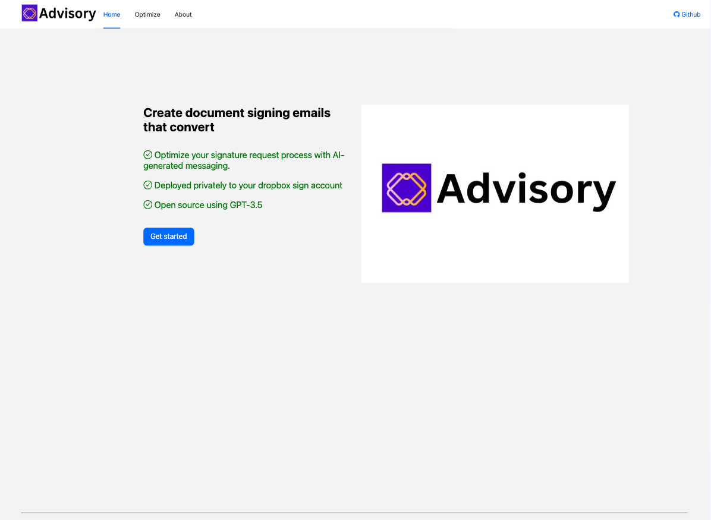
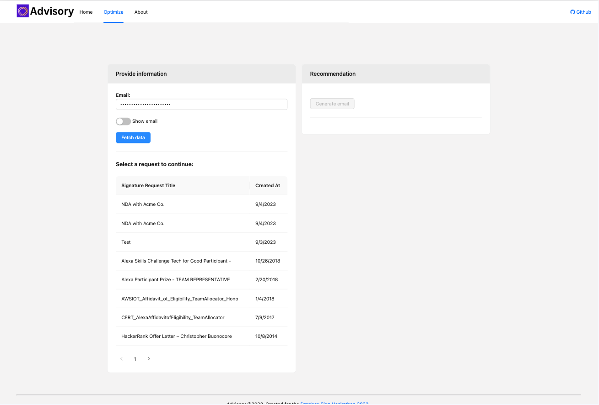
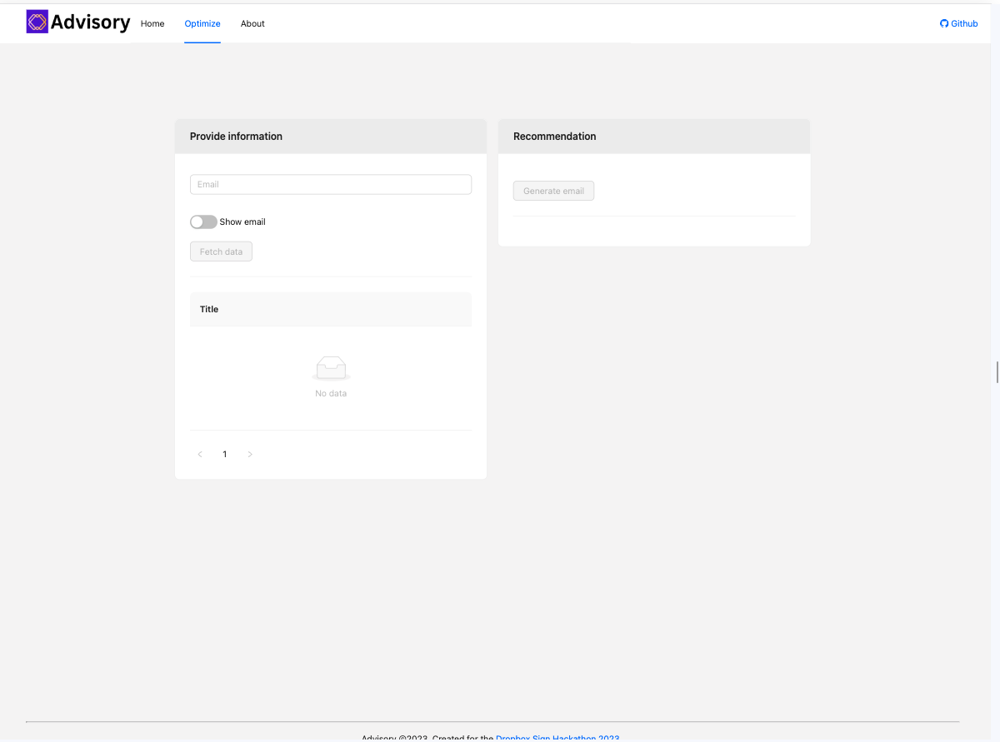
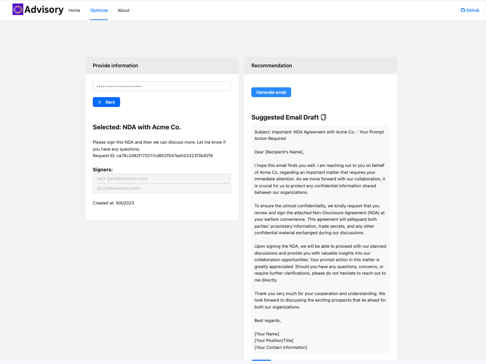
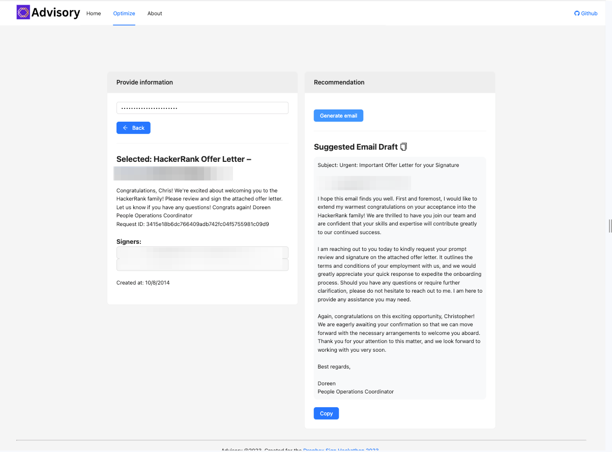
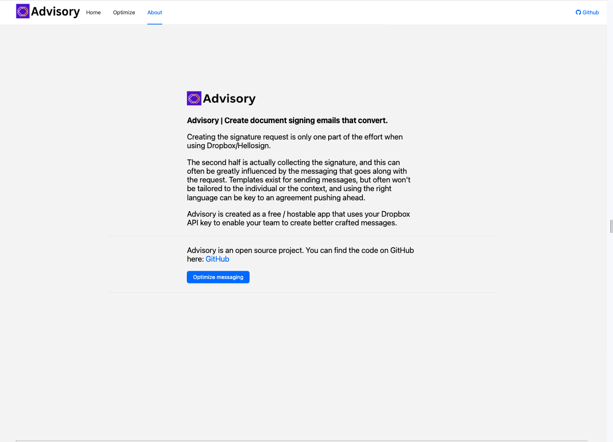

 

    

 
Advisory
---

Advisory is a email drafting platform for optimizing signature request language and conversion.

Built for the <a href="https://dropboxhackathon2023.devpost.com/">Dropbox Sign AI Hackathon 2023</a>.

Demo video: https://youtu.be/ZJcXAMY0kys

## Inspiration

Creating the signature request is only one part of the effort when using Dropbox/Hellosign. 

The second half is collecting the signature, which can often be greatly influenced by the messaging that goes along with the request. Templates exist for sending messages, but usually won't be tailored to the individual or the context, and using the right language can be critical to an agreement pushing ahead.

Advisory is created as a free/hostable app that uses your Dropbox API key to enable your team to create better-crafted messages.

## What it does

Advisory takes the challenge out of crafting the perfect signature request email by fusing the context of the signature request with generative AI to give you an email draft to send to the signer.

## How to run

### Client
`yarn; yarn dev`

### Server

From `./server`

Set the following `.env` variables:
<pre>
    DROPBOX_KEY= // your key for dropbox sign api
    DROPBOX_CLIENT_ID= // your dropbox app client id
    OPENAI_KEY= // your open ai api key
</pre>

`yarn; yarn start`

The server does most of the heavy lifting around mapping to accounts that are within your app. If you have multiple emails within an organization and provide an organization access key, an email within that account should work with the Advisory app.

## How we built it

Advisory was built using a combination of technologies and services to address the challenges of crafting the perfect signature request email. The key components and technologies used in the development of Advisory include:

Dropbox/Hellosign Integration: We integrated with the Dropbox Sign API and used the Dropbox app client ID to seamlessly create and manage signature requests. This integration allows users to initiate signature requests directly from Advisory. In particular the paginated list endpoint and signature request details endpoints are used.

OpenAI's Generative AI: We harnessed the power of OpenAI's Generative AI to assist users in composing the signature request email. OpenAI's AI models analyze the context of the signature request, such as the document being signed and the recipient's details, and generate a well-crafted email draft.

Node.js Server: We implemented a Node.js server to handle the communication between the Advisory platform, Dropbox/Hellosign, and OpenAI's API. The server orchestrates the entire process, from gathering input data to generating the email draft.

## Challenges we ran into

Data Mapping and Authentication: One of the challenges was mapping user accounts within the application and ensuring secure authentication. This was necessary to link the appropriate Dropbox accounts with Advisory and ensure that signature requests were sent to the correct recipients.

Integration Complexity: Integrating with external services like Dropbox Sign API and OpenAI's API can be complex due to the intricacies of their respective documentation and authentication requirements.

Natural Language Generation: Developing a reliable and context-aware natural language generation system can be challenging. We had to fine-tune OpenAI's AI model to ensure it generated accurate and coherent email drafts.

## Accomplishments that we're proud of

 Advisory simplifies the process of crafting signature request emails, saving users time and effort. The generated email drafts are contextually relevant, making it easier to collect signatures.

## What we learned

API Integration: We learned how to effectively integrate with third-party APIs, manage authentication, and handle data exchange.

Natural Language Generation: We improved our understanding of natural language generation and how to tailor AI-generated content to specific contexts.

User-Centric Design: We prioritized user experience and learned the importance of creating a user-friendly interface to make complex tasks more accessible.

## What's next for Advisory / Potential future work

Advisory is an open source project and can be deployed for your unique organization locally/securely. Can use your existing Dropbox Sign account and an OpenAI API key to quickly draft emails for all your requests.

1. Multi-Language Support: Extend Advisory's natural language generation capabilities to support multiple languages, catering to a more diverse user base.
2. AI Customization: Provide users with the ability to fine-tune and customize the AI model's behavior, allowing for more personalized and industry-specific email drafting.
3. Collaboration Features: Develop collaborative features that enable multiple team members to work on and review signature request emails within Advisory, streamlining the approval process.
4. Analytics and Insights: Implement analytics and reporting tools to help users track the success rate and efficiency of their signature request email campaigns, providing valuable insights for optimization.

## Screenshots

### Home

### Listing requests for a connected account

### Optimize

### NDA example

### Offer example

### About page

## Useful links
* https://developers.hellosign.com/api/quickstart/
* https://github.com/hellosign/dropbox-sign-node
* https://legaltemplates.net/form/lease-agreement/